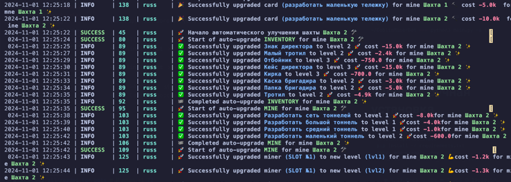

[](https://t.me/hidden_coding)

[](https://t.me/hidden_codding_chat)

[](https://t.me/cityholder/game?startapp=1092379081
)

# Бот для [CITYHolderGame](https://t.me/cityholder/game?startapp=1092379081
)



# Делает все
1. Тапает
2. Строит город

## Функционал


| Функция                               | Поддерживается |
|---------------------------------------|:--------------:|
| Многопоточность                       |       ✅        |
| Привязка прокси к сессии              |       ✅        |
| Задержка перед запуском каждой сессии |       ✅        |
| Автоматические тапы                   |       ✅        |
| Авто постойка города                  |       ✅        |
| Docker                                |       ✅        |

## Настройки

| Опция                   | Описание                                                                                  |
|-------------------------|-------------------------------------------------------------------------------------------|
| **API_ID / API_HASH**   | Данные платформы для запуска сессии Telegram                                              |
| **TAPS_ENABLED**        | Тапы включены дефолт `True` возможно(`False`)                                             |
| **RANDOM_SLEEP_TIME**   | Время сна после завершения всех действий бота дефолт `[1300, 1700]`                       |

**API_ID** и **API_HASH** вы можете получить после создания приложения
на [my.telegram.org/apps](https://my.telegram.org/apps)

## Быстрый старт
## Предварительные условия

Прежде чем начать, убедитесь, что у вас установлено следующее:

- [Python](https://www.python.org/downloads/) **версии 3.10**

## Получение API ключей

1. Перейдите на сайт [my.telegram.org](https://my.telegram.org) и войдите в систему, используя свой номер телефона.
2. Выберите **"API development tools"** и заполните форму для регистрации нового приложения.
3. Запишите `API_ID` и `API_HASH` в файле `.env`, предоставленные после регистрации вашего приложения.

## Установка

Вы можете скачать [**Репозиторий**](https://github.com/paveL1boyko/CITYHolderGame.git) клонированием на вашу систему и
установкой необходимых зависимостей:

```shell
git clone https://github.com/paveL1boyko/CITYHolderGame.git
cd CITYHolderGame
```

Затем для автоматической установки введите:

Windows:

```shell
run.bat
```

Linux:

```shell
run.sh
```

# Linux ручная установка

```shell
python3 -m venv venv
source venv/bin/activate
pip3 install -r requirements.txt
cp .env-example .env
nano .env  # Здесь вы обязательно должны указать ваши API_ID и API_HASH , остальное берется по умолчанию
python3 main.py
```

Также для быстрого запуска вы можете использовать аргументы, например:

```shell
~/CITYHolderGame >>> python3 main.py --action (1/2)
# Or
~/CITYHolderGame >>> python3 main.py -a (1/2)

# 2 - Запускает кликер
# 1 - Создает сессию
```

# Windows ручная установка

```shell
python -m venv venv
venv\Scripts\activate
pip install -r requirements.txt
copy .env-example .env
# Указываете ваши API_ID и API_HASH, остальное берется по умолчанию
python main.py
```

Также для быстрого запуска вы можете использовать аргументы, например:

```shell
~/CITYHolderGame >>> python main.py --action (1/2)
# Или
~/CITYHolderGame >>> python main.py -a (1/2)

# 2 - Запускает кликер
# 1 - Создает сессию
```
